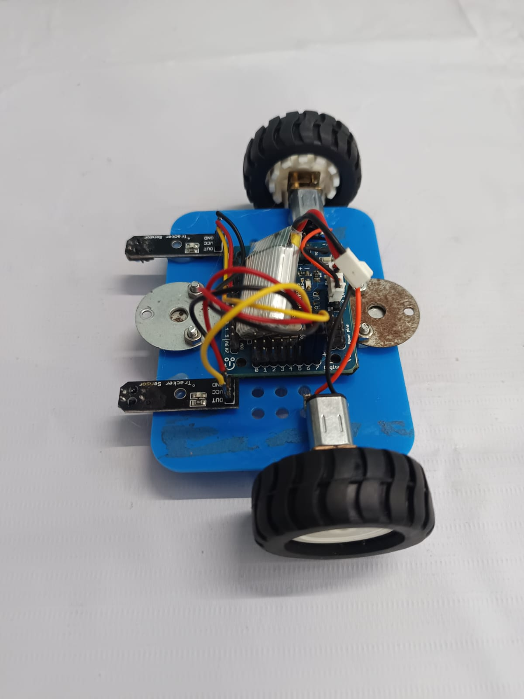
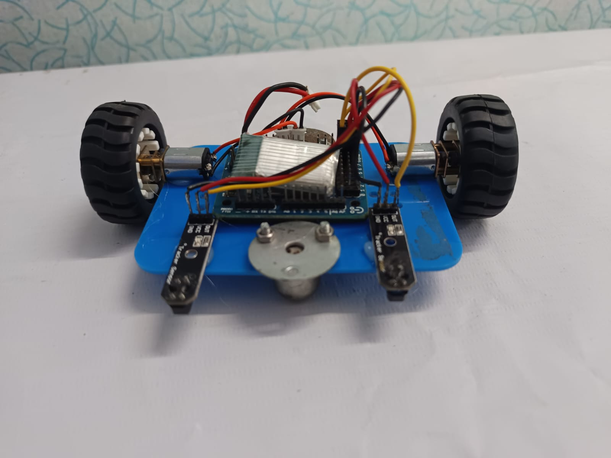

# 🤖 Line Follower Robot — Arduino Nano

A clean, well-documented line follower robot using **2 IR sensors** and an **Arduino Nano**. Follows a black line on a white surface using bang-bang control with a lost-line recovery state machine.

---

## 📋 Table of Contents

- [Demo](#-demo)
- [Features](#-features)
- [Hardware Required](#-hardware-required)
- [Circuit & Connections](#-circuit--connections)
- [How to Upload](#-how-to-upload)
- [Tuning Guide](#-tuning-guide)
- [How It Works](#-how-it-works)
- [Troubleshooting](#-troubleshooting)
- [License](#-license)

---

## 🎥 Demo

**Output video — robot in action:**


https://github.com/user-attachments/assets/70d2439e-7688-4f23-a418-ce6f39a6ad68


---

## 📸 Photos




---

## ✨ Features

- Follows black line on white surface
- Bang-bang control with PWM speed adjustment
- State machine: `FOLLOWING → TURNING → LOST → STOPPED`
- Lost-line recovery — continues last correction for 800ms before stopping
- Serial debug output for easy tuning
- All pin assignments and speeds in `#define` constants at the top

---

## 🛒 Hardware Required

| Component | Quantity | Notes |
|---|---|---|
| Arduino Nano | 1 | Any clone works |
| IR sensor module (TCRT5000) | 2 | With onboard comparator & LED |
| L293D motor driver IC | 1 | Control's Motors |
| N20 DC gear motors | 2 | 3V–6V, any RPM (100–300 recommended) |
| Wheels + chassis | 1 set | — |
| Li-ion / 5V–6V battery | 1 | Keep voltage low — see warning |
| Jumper wires | — | Male–male and male–female |
| USB cable (Mini-B) | 1 | For uploading code |

> The L293D is primarily designed for small DC motors under **600 mA per channel**. It has a significant internal voltage drop of **~1.4V per H-bridge side (~2.8V total)**, meaning your N20 motors receive noticeably less voltage than your supply. At 5V supply, motors may only see ~2.2V — enough to run but with reduced torque and speed.
>
> **This robot was built without the L293D and it works** — for lightweight N20 motors on a small chassis it is acceptable. But for any future build, upgrade to an **L298N module** (2A per channel, onboard 5V regulator) or **TB6612FNG** (1.2A per channel, no voltage drop, more efficient). The L293D is a common "learn on it" chip but not a production choice.

---

## 🔌 Circuit & Connections

### Pin Map Summary

| Arduino Nano Pin | Connected To | Notes |
|---|---|---|
| `D6` | IR Left — OUT | Sensor output |
| `D7` | IR Right — OUT | Sensor output |
| `D8` | L293D — IN1 | Left motor direction A |
| `D9` | L293D — IN2 | Left motor direction B (PWM) |
| `D10` | L293D — IN3 | Right motor direction A (PWM) |
| `D11` | L293D — IN4 | Right motor direction B (PWM) |
| `5V` | IR VCC × 2, L293D VCC1 (logic) | Power for sensors & logic |
| `GND` | IR GND × 2, L293D GND | Common ground |

> ⚠️ **Motor power:** Connect your battery to L293D **VCC2** (motor supply pin 8). Keep voltage at **5V–6V max** for N20 motors — the L293D drops ~2.8V internally so motors get less than your supply. Do **not** use a 9V PP3 battery; use 4× AA (6V) or a small Li-ion pack.

### Wiring Diagram

```
                       ┌──────────────┐
  IR Left  ────────────┤ D6           │
  IR Right ────────────┤ D7           │
                       │              │
  L293D IN1 ───────────┤ D8           │
  L293D IN2 ───────────┤ D9    NANO   │
  L293D IN3 ───────────┤ D10          │
  L293D IN4 ───────────┤ D11          │
                       │              │
  L293D VCC1 ──────────┤ 5V           │
  Common GND ──────────┤ GND          │
                       └──────────────┘

  ┌─────────────────────────────────────────────┐
  │             L293D IC (DIP-16)               │
  │                                             │
  │  Pin 1  (EN1,2) ──── 5V (always enabled)   │
  │  Pin 2  (IN1)   ──── D8                    │
  │  Pin 7  (IN2)   ──── D9  (PWM)             │
  │  Pin 3  (OUT1)  ──── LEFT MOTOR  +         │
  │  Pin 6  (OUT2)  ──── LEFT MOTOR  -         │
  │                                             │
  │  Pin 9  (EN3,4) ──── 5V (always enabled)   │
  │  Pin 10 (IN3)   ──── D10 (PWM)             │
  │  Pin 15 (IN4)   ──── D11                   │
  │  Pin 11 (OUT3)  ──── RIGHT MOTOR +         │
  │  Pin 14 (OUT4)  ──── RIGHT MOTOR -         │
  │                                             │
  │  Pin 8  (VCC2)  ──── Battery + (5–6V)      │
  │  Pin 16 (VCC1)  ──── 5V (logic)            │
  │  Pin 4,5,12,13  ──── GND (all 4 GND pins)  │
  └─────────────────────────────────────────────┘

  ┌─────────────────────┐
  │   IR SENSOR MODULE  │ × 2
  │                     │
  │  VCC ──── 5V (Nano) │
  │  GND ──── GND       │
  │  OUT ──── D6 or D7  │
  │  (adjust trim pot   │
  │   until LED dims    │
  │   exactly on line)  │
  └─────────────────────┘
```

### IR Sensor Placement

Place sensors **side by side**, separated by roughly the **width of your black line** (typically 15–20 mm gap between them). Mount them **5–10 mm above the surface**.

```
     ← Robot front →

     [IR-L]   [IR-R]
        ↕         ↕
      5-10mm from ground
     |←~15-20mm→|
```

---

## 💻 How to Upload

1. Install **Arduino IDE** — [download here](https://www.arduino.cc/en/software)
2. Connect Arduino Nano via USB
3. In Arduino IDE:
   - **Tools → Board → Arduino Nano**
   - **Tools → Processor → ATmega328P** (or Old Bootloader if upload fails)
   - **Tools → Port → COMx** (Windows) or `/dev/ttyUSBx` (Linux/Mac)
4. Open `src/LineFollower/LineFollower.ino`
5. Click **Upload** (→)
6. Open Serial Monitor at **115200 baud** to see live debug output

---

## 🎛️ Tuning Guide

All tunable values are `#define` constants at the top of the `.ino` file:

```cpp
#define SPEED_FWD    180   // Forward speed (0–255)
#define SPEED_TURN   140   // Inner motor speed while turning
#define SPEED_PIVOT   90   // Outer pivot speed on corrections
#define LOST_TIMEOUT 800   // ms before declaring line lost
```

| Symptom | Fix |
|---|---|
| Robot overshoots turns | Reduce `SPEED_FWD` or increase `SPEED_PIVOT` |
| Robot too slow / stalls | Increase `SPEED_FWD` |
| Robot wiggles excessively | Reduce `SPEED_TURN`, increase `SPEED_PIVOT` |
| Stops too quickly when off line | Increase `LOST_TIMEOUT` |
| One motor faster than other | Lower the faster motor's speed constant |

### Adjusting IR Sensitivity

Each IR module has a **blue potentiometer**. Turn it until:
- The indicator LED turns **ON** when sensor is over white
- The indicator LED turns **OFF** when sensor is over black line

Do this calibration with the sensor at the actual **height** it will sit on the robot.

---

## ⚙️ How It Works

The robot reads both IR sensors every loop iteration and makes a decision:

```
Left ON  + Right ON  →  Go forward           (centred)
Left ON  + Right OFF →  Turn left            (drifted right)
Left OFF + Right ON  →  Turn right           (drifted left)
Left OFF + Right OFF →  Recovery or stop     (line lost)
```

**IR logic:** `LOW` = sensor sees black line, `HIGH` = sensor sees white surface.

**Recovery mode:** When both sensors lose the line, the robot continues its last motor command for `LOST_TIMEOUT` milliseconds, hoping to re-acquire. If the line isn't found in time, motors stop to prevent a runaway.

**State machine:**

```
          ┌──────────┐
          │ FOLLOWING│◄──── both on line
          └────┬─────┘
    left only  │  right only
       ┌───────┴────────┐
       ▼                ▼
  ┌──────────┐    ┌───────────┐
  │TURN_LEFT │    │TURN_RIGHT │
  └──────────┘    └───────────┘
       │ both off line  │
       └───────┬─────────┘
               ▼
           ┌──────┐
           │ LOST │──── timeout ──► STOPPED
           └──────┘
```

---

## 🔧 Troubleshooting

**Robot doesn't move at all**
- Check battery is connected to L298N `12V` terminal
- Verify L298N enable jumpers are in place (ENA/ENB pins shorted)
- Check motor wiring: swap A+ / A- if a motor spins backwards

**Robot spins in circles**
- One motor is wired in reverse — swap that motor's OUT+/OUT- on L298N

**Robot ignores the line completely**
- Re-calibrate IR sensor potentiometers (see tuning guide above)
- Check sensor output with `Serial.println(digitalRead(IR_LEFT))` — should be `0` over black, `1` over white

**Upload fails**
- Try **Old Bootloader** under Tools → Processor (common on clone Nanos)
- Try a different USB cable

**Serial Monitor shows garbage**
- Make sure baud rate is set to `115200` in the Serial Monitor dropdown

---

---

## 🗺️ Roadmap / Upgrade Ideas

- [ ] Add PID control (smoother tracking)
- [ ] Add HC-SR04 for obstacle avoidance
- [ ] Add OLED display for speed/state readout
- [ ] Upgrade to ESP32 for WiFi dashboard
- [ ] Add more IR sensors for intersection detection & pathfinding

---

## 📄 License

MIT License — see [LICENSE](LICENSE) for details.

---

## 🙋 Author

**Fawaz**
SR University, Telangana
Centre for Creative Cognition

> *Built as part of robotics portfolio — feel free to fork and improve!*
